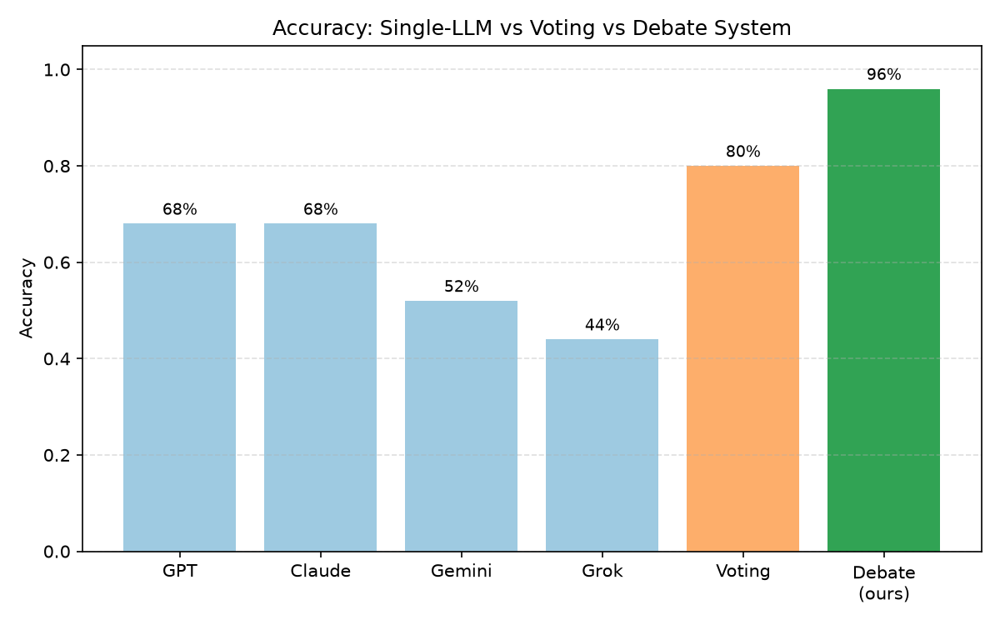

# Multi-LLM Collaborative Debate System

A production-style Python pipeline where **four LLMs collaborate** to solve hard
reasoning problems. Three models act as independent **Solvers**; they
peer-review each other's work, refine their answers based on the critiques, and
a fourth model acts as the **Final Judge** that selects the best solution.

The whole system runs **end-to-end with zero API keys** thanks to a built-in
deterministic mock client, and switches to real providers (OpenAI, Anthropic,
Google, xAI) with a single flag.

---

## Table of contents
- [Project overview](#project-overview)
- [Motivation](#motivation)
- [Architecture](#architecture)
- [Workflow stages](#workflow-stages)
- [Dataset](#dataset)
- [Setup](#setup)
- [Configuring API keys (`.env`)](#configuring-api-keys-env)
- [Running in mock mode](#running-in-mock-mode)
- [Running in real mode](#running-in-real-mode)
- [Generating plots](#generating-plots)
- [Evaluation metrics](#evaluation-metrics)
- [Example debate trace](#example-debate-trace)
- [Tests](#tests)
- [Limitations](#limitations)
- [Future improvements](#future-improvements)

---

## Project overview

Single LLMs frequently hallucinate or make silent reasoning errors on hard
problems. This project combats that by forcing **diverse perspectives** and
**adversarial review**: multiple models solve independently, critique each
other, revise, and a judge arbitrates. The system is evaluated on **25
challenging problems** with automatically checkable answers and compared
against two baselines (single model and majority voting).

## Motivation

- **Reduce hallucination** through cross-examination — a wrong step that one
  model misses is often caught by a peer.
- **Measure whether collaboration helps.** We don't just build the system; we
  quantify it against baselines and produce plots.
- **Be reproducible and cheap.** Mock mode makes the entire pipeline runnable
  offline and deterministic, which is ideal for tests, CI, and development.

## Architecture

```
multi-llm-debate-system/
├── data/
│   ├── problems.jsonl            # 25 challenge problems (the dataset)
│   └── example_problems.jsonl    # tiny set for quick demos
├── src/
│   ├── config.py                 # paths, model registry, defaults, .env loading
│   ├── models.py                 # Pydantic schemas for every stage
│   ├── utils.py                  # JSON extraction, jsonl loading, voting
│   ├── llm_clients/              # interchangeable provider clients
│   │   ├── base.py               # BaseLLMClient interface
│   │   ├── mock_client.py        # deterministic offline client (no keys)
│   │   ├── openai_client.py      # GPT
│   │   ├── anthropic_client.py   # Claude
│   │   ├── google_client.py      # Gemini
│   │   └── xai_client.py         # Grok (OpenAI-compatible)
│   ├── prompts/                  # one strict-JSON prompt builder per stage
│   ├── pipeline/
│   │   ├── role_assignment.py    # Stage 0 + 0.5
│   │   ├── debate_runner.py      # orchestrates all stages for one problem
│   │   ├── answer_extraction.py  # normalize_answer / is_correct
│   │   └── evaluation.py         # results.csv + metrics
│   └── plotting/plots.py         # the five matplotlib figures
├── notebooks/                    # 01 dataset, 02 run, 03 plots
├── outputs/
│   ├── runs/{run_id}/{id}.json   # cached per-problem traces
│   ├── plots/*.png               # generated figures
│   └── results.csv               # per-problem evaluation table
├── tests/                        # pytest suite
├── main.py                       # CLI entry point
├── requirements.txt
└── .env.example
```

The pipeline only ever talks to the `BaseLLMClient` interface, so mock and real
clients are fully interchangeable.

## Workflow stages

1. **Stage 0 — Role self-assessment.** Each of the 4 models reports its Solver
   confidence, Judge confidence, and reasoning for *this* problem.
2. **Stage 0.5 — Deterministic role assignment.** The model with the highest
   judge confidence becomes the **Judge**; the other three become Solvers. Ties
   are broken by the fixed priority order `gpt > claude > gemini > grok`.
3. **Stage 1 — Independent solving.** Each Solver solves alone (no peeking) and
   outputs step-by-step reasoning, a final answer, and confidence.
4. **Stage 2 — Peer review.** Each Solver writes **2 structured reviews** (one
   per peer) covering strengths, weaknesses, concrete errors, suggested
   changes, and an overall assessment.
5. **Stage 3 — Refinement.** Each Solver receives the 2 reviews of its own
   solution, explicitly **accepts valid critiques** and **rejects invalid ones
   with justification**, and produces a refined answer.
6. **Stage 4 — Final judgment.** The Judge sees all original solutions, all
   reviews, and all refined solutions, then picks a winner. The winning Solver's
   refined answer becomes the **final debate answer**.

Every problem's full trace is cached to `outputs/runs/{run_id}/{problem_id}.json`.

## Dataset

`data/problems.jsonl` contains **25 problems** across four categories:

| Category | Count | Examples |
|---|---|---|
| `mathematical_reasoning` | 8 | domino tilings, derangements, divisor counts |
| `physics_science` | 6 | ladder friction, projectiles, collisions, photons |
| `logic_constraint` | 7 | knights & knaves, ordering puzzles, label puzzles |
| `game_theory` | 4 | Vickrey auctions, Prisoner's Dilemma, Nim |

Each problem is fully self-describing and **automatically checkable**:

```json
{
  "id": "math_001",
  "category": "mathematical_reasoning",
  "question": "In how many ways can you tile a 3x8 rectangle with 2x1 dominoes?",
  "correct_answer": "153",
  "accepted_answers": ["153"],
  "answer_type": "integer",
  "difficulty": "hard",
  "source_or_notes": "Classic domino tiling recurrence."
}
```

Supported `answer_type` values: `integer`, `float` (optional `tolerance`),
`multiple_choice`, `short_text`.

## Setup

Requires **Python 3.11+**.

```bash
# 1. (recommended) create a virtual environment
python -m venv .venv
source .venv/bin/activate        # Windows: .venv\Scripts\activate

# 2. install dependencies
pip install -r requirements.txt
```

Only the core libraries are required for mock mode. The provider SDKs
(`openai`, `anthropic`, `google-generativeai`) are optional and listed
(commented) at the bottom of `requirements.txt`.

## Configuring API keys (`.env`)

Mock mode needs **no keys**. For real mode, copy the template and fill in the
providers you want:

```bash
cp .env.example .env     # Windows: copy .env.example .env
```

```ini
OPENAI_API_KEY=sk-...
ANTHROPIC_API_KEY=...
GOOGLE_API_KEY=...
XAI_API_KEY=...
```

Keys are read via `python-dotenv`. They are **never hardcoded**, and `.env` is
git-ignored. A missing key raises a clear error telling you to add it or use
mock mode.

> **Free option:** As the assignment allows, you can point all four roles at a
> single free model by setting the same model id in the `*_MODEL` env vars; the
> four roles still run as four independent calls with different prompts.

## Running in mock mode

```bash
# Full pipeline on 3 problems, offline and deterministic
python main.py --mode mock --limit 3

# Full 25-problem run with a named run id
python main.py --mode mock --run-id mock_demo
```

This produces `outputs/runs/<run_id>/*.json`, `outputs/results.csv`,
`outputs/metrics.json`, and the five plots in `outputs/plots/`.

## Running in real mode

```bash
python main.py --mode real --problems data/problems.jsonl
python main.py --mode real --run-id final_run_01 --skip-existing true
```

**CLI arguments**

| Flag | Default | Description |
|---|---|---|
| `--mode` | `mock` | `mock` (offline) or `real` (uses provider APIs) |
| `--problems` | `data/problems.jsonl` | Path to a `.jsonl` dataset |
| `--limit` | `None` | Only run the first *N* problems |
| `--run-id` | timestamped | Folder name under `outputs/runs/` |
| `--skip-existing` | `false` | Don't rerun problems that already have a cached trace |
| `--no-plots` | off | Skip plot generation |

**Caching / resuming.** Every problem run is saved immediately, so a crash or
rate-limit doesn't lose progress. Re-running with `--skip-existing true` reuses
cached traces and only computes missing problems.

## Generating plots

Plots are generated automatically at the end of every run. To (re)generate them
from an existing run without re-running the debate, use notebook
`03_evaluation_plots.ipynb`, or:

```python
from src.pipeline.evaluation import evaluate_run
from src.plotting import generate_all_plots
df, metrics = evaluate_run("mock_demo")
generate_all_plots(metrics)
```

Generated figures (in `outputs/plots/`):

- `accuracy_comparison.png` — single models vs voting vs debate
- `accuracy_by_category.png` — debate accuracy per problem category
- `refinement_improvement.png` — system accuracy + refinement improvement rate
- `consensus_rate.png` — how often all 3 solvers initially agree
- `judge_accuracy_disagreement.png` — judge accuracy when solvers disagree

## Evaluation metrics

`outputs/results.csv` has one row per problem with columns including:
`problem_id`, `category`, `correct_answer`, the three initial and three refined
solver answers, `judge_winner`, `debate_final_answer`, `debate_correct`,
`voting_answer`, `voting_correct`, `consensus_type`,
`improved_after_refinement`, and `judge_correct_when_disagreement`.

Computed system metrics (also saved to `outputs/metrics.json`):

- **Overall Accuracy** — % of problems where the final debate answer is correct.
- **Improvement Rate** — % of problems where refinement increased the number of
  correct solver answers.
- **Consensus Rate** — % of problems where all 3 solvers initially agreed.
- **Judge Accuracy (disagreement)** — when solvers disagree, how often the
  judge picks a correct answer.
- **Single-LLM Baseline Accuracy** — average accuracy of each model answering
  once (also reported per model).
- **Simple Voting Baseline Accuracy** — majority of the 3 initial answers.
- **Full Debate System Accuracy** — the headline number.

**Sample mock run (25 problems)** — illustrative numbers from the bundled
deterministic mock (your real-API numbers will differ):

| System | Accuracy |
|---|---|
| Single-LLM baseline (avg) | 58% |
| Simple voting baseline | 80% |
| **Full debate system** | **96%** |



## Example debate trace

Abbreviated trace for a single problem (full JSON lives in `outputs/runs/`):

```text
PROBLEM:  In how many ways can you tile a 3x8 rectangle with 2x1 dominoes?
CORRECT:  153

Stage 0.5  Roles -> Judge: gpt | Solvers: {solver_1: claude, solver_2: gemini, solver_3: grok}
Stage 1    Independent answers -> solver_1=153, solver_2=155, solver_3=153
Stage 2    Peer reviews -> 6 structured reviews (each solver reviews 2 peers)
Stage 3    Refined answers -> solver_1=153, solver_2=153, solver_3=153
Stage 4    Judge picks solver_1
FINAL DEBATE ANSWER: 153   (correct)
```

## Tests

```bash
pytest -q
```

The suite covers: deterministic role assignment (incl. tie-breaks), answer
normalization/checking for all four answer types, a full mock pipeline run for
one problem end-to-end, and that the evaluation output contains the expected
fields.

## Limitations

- The bundled **mock client simulates** model behaviour (it is given the answer
  key to produce realistic accuracy). Mock numbers demonstrate the pipeline and
  plots, not real model capability — use `--mode real` for genuine results.
- Answer checking is **string/numeric based**. Free-form `short_text` answers
  rely on the `accepted_answers` list; unusual phrasings may be marked wrong.
- Real runs make **many API calls per problem** (4 self-assessments + 3 solves +
  6 reviews + 3 refinements + 1 judge + 4 baselines), so cost/latency scale up.
- No automated retry/backoff on provider rate limits (use `--skip-existing` to
  resume).

## Future improvements

- LLM-as-judge or embedding-based answer equivalence for `short_text`.
- Async/parallel client calls to cut wall-clock time.
- Retry with exponential backoff and per-provider rate limiting.
- More problems and per-difficulty breakdowns in the plots.
- Optional multi-round debate (more than one refinement round).
